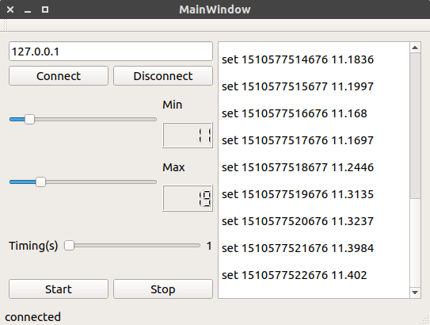
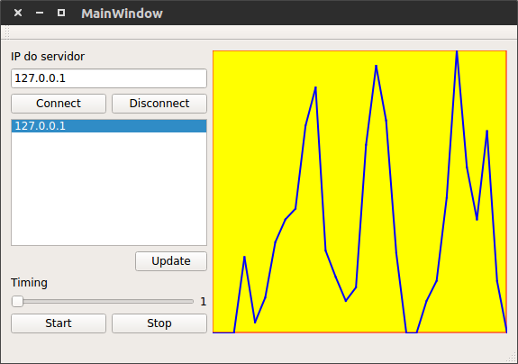

# Smart Data Supervisor (Sistema Supervisório TCP/IP)

Um sistema distribuído de aquisição e monitoramento de dados desenvolvido em C++ utilizando o framework Qt. O projeto simula uma arquitetura **SCADA** (Supervisory Control and Data Acquisition), permitindo a geração de dados por múltiplos clientes, armazenamento em um servidor multithread e visualização gráfica em tempo real.

## Arquitetura do Sistema

O projeto é dividido em três módulos independentes que se comunicam via protocolo TCP/IP:

1.  **`Servidor (Data Server)`:** Gerencia conexões, armazena dados recebidos de múltiplos produtores e entrega dados aos consumidores.
2. **`Produtor (Data Producer)`:** Simula um sensor ou dispositivo IoT. Gera dados numéricos aleatórios e os envia periodicamente ao servidor.
3. **`Consumidor (Data Consumer)`:** Monitora a rede. Solicita a lista de produtores ativos e plota gráficos em tempo real dos dados recebidos.

## Detalhes dos Módulos

1.  **`Servidor (QtTcpServer)`:** O núcleo do sistema, responsável pela persistência e roteamento dos dados.
    - Multithreading: Utiliza a classe `QTcpServer` em conjunto com `QThread`. Cada novo cliente (seja produtor ou consumidor) é tratado em uma thread separada (`MyThread`), garantindo que o servidor permaneça responsivo mesmo com múltiplas conexões simultâneas.
    - Armazenamento Thread-Safe: Implementa uma classe `DataStorage` protegida por `QMutex`. Isso previne condições de corrida (race conditions) quando múltiplos produtores tentam escrever e consumidores tentam ler dados simultaneamente na mesma memória.
    - Protocolo: Interpreta e responde a comandos de texto simples (set, get, list).
2. **`Produtor (QtTcpClientProducer)`:** O cliente que "alimenta" o sistema com informações.
    - Gerador de Dados: Produz números aleatórios dentro de um intervalo (Min/Max) configurável pelo usuário através de sliders.
    - Temporização: Utiliza `QTimer` para controlar a frequência automática de envio dos dados.
    - Interface: Permite conectar/desconectar do servidor e visualizar o log de mensagens enviadas em tempo real.
3. **`Consumidor (QtTcpClientConsumer)`:** O painel de visualização para o usuário final.
    - Monitoramento: Possui um botão de `Update` que solicita ao servidor a lista de IPs de produtores que estão enviando dados ativamente.
    - Plotter Customizado: Utiliza um Widget personalizado (`Plotter`), desenhado manualmente com a classe `QPainter`, para renderizar gráficos de linha eficientes e customizáveis.
    - Polling: Realiza requisições periódicas ao servidor para manter o gráfico atualizado com os últimos dados do produtor selecionado.

## Protocolo de Comunicação

O sistema utiliza um protocolo de texto simples (ASCII) sobre TCP. Os comandos implementados no servidor são:
| Comando | Descrição | Exemplo de Uso |
| :--- | :--- | :--- |
| `list` | Retorna a lista de IPs dos produtores conectados. | `list` |
| `set <time> <value>` | Envia um dado (timestamp e valor) para o servidor armazenar. | `set 174000 25.5` |
| `get <ip> <n>` | Solicita os últimos `n` dados do produtor com o IP especificado. | `get 127.0.0.1 30` |

## Como Compilar e Executar

### Pré-requisitos
    - Qt Framework (versão 5 ou 6).
    - Qt Creator (IDE recomendada).
    - Compilador C++ compatível (MinGW no Windows, GCC no Linux, Clang no macOS).

### Passo a Passo

1.  **`Inicie o Servidor`:** 
    - Abra o projeto `QtTcpServer.pro` no Qt Creator.
    - Compile e execute (Build & Run).
    - O servidor iniciará escutando na porta 1234 e exibirá o IP da máquina.
2. **`Inicie um Produtor`:** 
    - Abra o projeto `QtTcpClientProducer.pro` e execute.
    - Insira o IP do servidor (ex: `127.0.0.1 para testes locais) e clique em Connect.
    - Configure os limites (Min/Max) e o intervalo do Timer.
    - Clique em Start para começar a enviar dados.
3. **`Inicie o Consumidor`:**
    - Abra o projeto `QtTcpClientConsumer.pro` e execute.
    - Insira o IP do servidor e clique em Connect.
    - Clique em Update para atualizar a lista de produtores disponíveis.
    - Selecione o IP desejado na lista lateral (Widget de Lista).
    - Clique em Start para iniciar a visualização do gráfico.

## Interface Gráfica e Componentes

### O projeto demonstra o uso de diversos componentes e técnicas do Qt:
- **Logs:** Uso de `QTextBrowser` para exibir histórico de comunicação.
- **Inputs:** Uso de `QSlider` e `QSpinBox` sincronizados (Signals & Slots) para configuração numérica intuitiva.
- **Gráficos (Plotter):** Implementação da classe `Plotter` que herda de `QWidget` e reimplementa o evento `paintEvent` para desenhar eixos, grids e curvas de dados usando primitivas gráficas.

| Produtor (Producer) | Consumidor (Consumer) |
| :---: | :---: |
|  |  |

